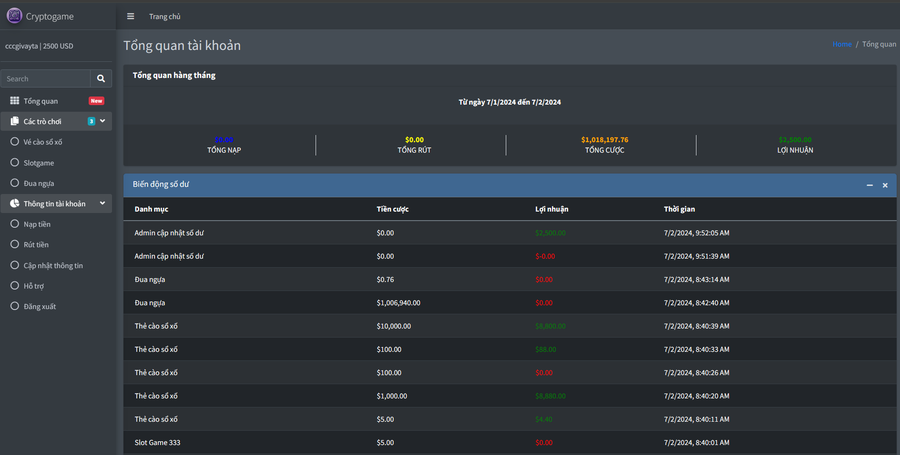
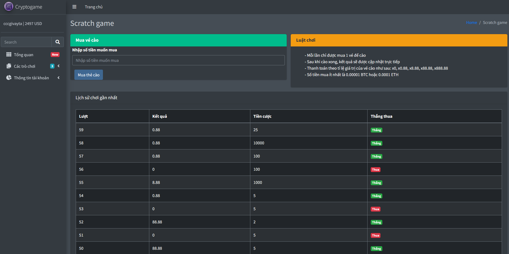
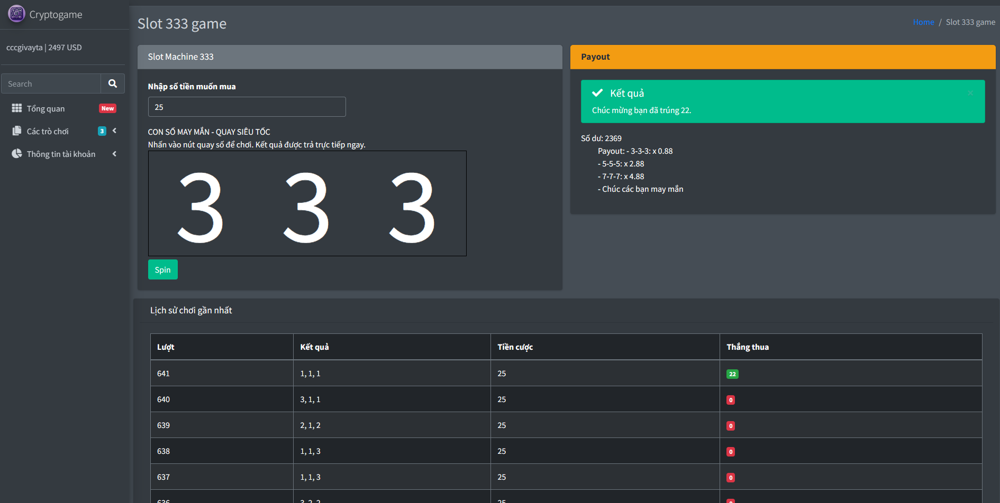
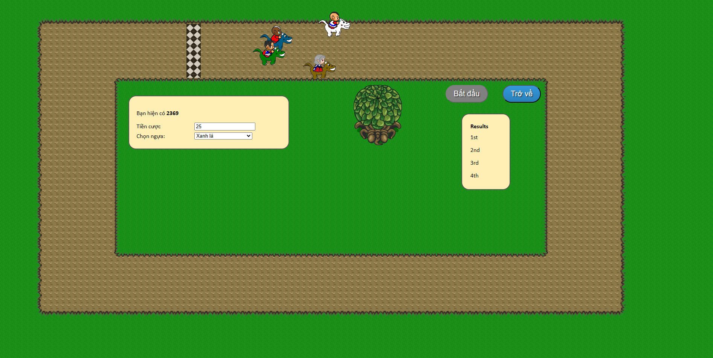
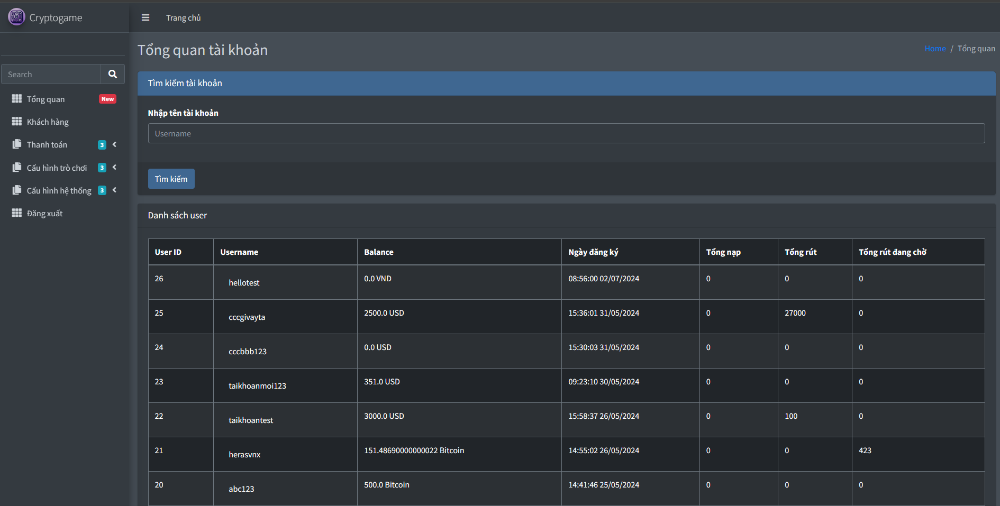

# Cryptogame

**Cryptogame** là một dự án ứng dụng web hiện đại, phát triển bằng Ruby on Rails 7, cung cấp một nền tảng chơi game trực tuyến đa dạng và hấp dẫn. Dự án bao gồm các trò chơi giải trí phổ biến như thẻ cào, slotgame và đua ngựa, nhằm mang đến trải nghiệm thú vị và phong phú cho người dùng.

**Cryptogame** is a modern web application project developed with Ruby on Rails 7, offering a diverse and engaging online gaming platform. The project features popular games such as scratch cards, slot games, and horse racing, providing an enjoyable and rich experience for users.

## Tính Năng Chính / Key Features

### Phần Người Dùng / User Section

- **Thông Tin Tổng Quát**: Cung cấp cái nhìn tổng quan về tài khoản và các hoạt động của người dùng.
  

  **Overview**: Provides a comprehensive view of the user’s account and activities.
  

- **Đổi Thông Tin**: Cho phép người dùng dễ dàng cập nhật thông tin cá nhân và thiết lập tài khoản của mình.

  **Update Information**: Allows users to easily update their personal details and manage their account settings.

- **Chơi Các Trò Chơi**: Trải nghiệm các trò chơi giải trí bao gồm thẻ cào, slotgame và đua ngựa.
  
  
  
  
  **Play Games**: Experience a variety of entertainment games including scratch cards, slot games, and horse racing.
  
  
  

- **Nạp Tiền**: Hỗ trợ nạp tiền vào tài khoản người dùng qua bitcoin và đang tích hợp thêm phương thức nạp bằng VND.

  **Deposit Funds**: Supports depositing funds into user accounts via bitcoin, with plans to integrate VND support.

- **Rút Tiền**: Cung cấp tính năng rút tiền từ tài khoản của người dùng một cách thuận tiện và an toàn.

  **Withdraw Funds**: Allows users to withdraw money from their accounts in a convenient and secure manner.

### Phần Admin / Admin Section

- **Xem Thông Tin Tổng Quát**: Theo dõi và quản lý các hoạt động cùng số liệu quan trọng của hệ thống.
  

  **Overview Management**: Monitors and manages system activities and key metrics.
  

- **Xem Chi Tiết Người Dùng**: Truy cập thông tin chi tiết và theo dõi hoạt động của từng người dùng.

  **User Details**: Access detailed information and track individual user activities.

- **Duyệt Nạp Tiền/Rút Tiền**: Xem xét và phê duyệt các yêu cầu nạp tiền và rút tiền từ người dùng.

  **Approve Deposits/Withdrawals**: Review and approve user deposit and withdrawal requests.

- **Cấu Hình Nạp Tiền/Rút Tiền**: Quản lý và cấu hình các phương thức nạp tiền và rút tiền để đảm bảo sự linh hoạt và hiệu quả.

  **Configure Deposits/Withdrawals**: Manage and configure deposit and withdrawal methods to ensure flexibility and efficiency.

## Cơ Sở Dữ Liệu / Database
Dự án sử dụng **SQLite** làm cơ sở dữ liệu chính, đảm bảo sự ổn định và hiệu quả trong việc lưu trữ dữ liệu.

The project uses **SQLite** as the primary database, ensuring stability and efficiency in data storage.

## Tình Trạng Dự Án / Project Status
Dự án Cryptogame hiện đang trong giai đoạn phát triển và chưa hoàn thiện. Chúng tôi đang tích cực làm việc để hoàn thiện các tính năng chính, bao gồm việc cấu hình tỷ lệ cho các trò chơi nhằm mang lại sự công bằng và trải nghiệm tốt nhất cho người chơi.

Cryptogame is currently under development and not yet complete. We are actively working on finalizing key features, including configuring game ratios to ensure fairness and the best possible experience for players.

Chúng tôi rất mong nhận được sự ủng hộ và phản hồi từ cộng đồng để cùng nhau hoàn thiện và nâng cao chất lượng của Cryptogame.

We welcome feedback and support from the community to help us refine and enhance Cryptogame.

---

### Credit

This project was developed by Ngân **ExplB2412**. 
